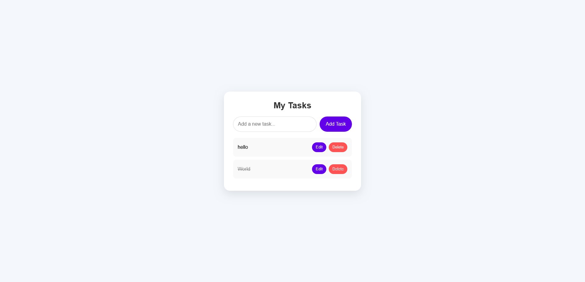
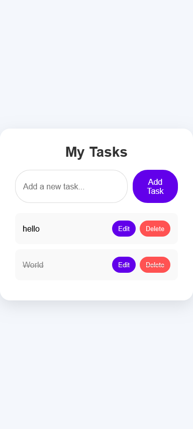

# todo-list-html-css-js

## Table of contents

- [Overview](#overview)
  - [The challenge](#the-challenge)
  - [Screenshot](#screenshot)
  - [Links](#links)
- [My process](#my-process)
  - [Built with](#built-with)

## Overview

### The challenge

Users should be able to:

- View the optimal layout for the site depending on their device's screen size
- Add a task
- Update a task
- Delete a task
- click on a task to mark as complete
- see a notification whenever they add or update or delete a task

### Screenshot

### Links

- Live Site URL: [Todo List](https://ahmedmekkawy27.github.io/todo-list-html-css-js/)

## My process

### Built with

- HTML5
- CSS
- javascript
